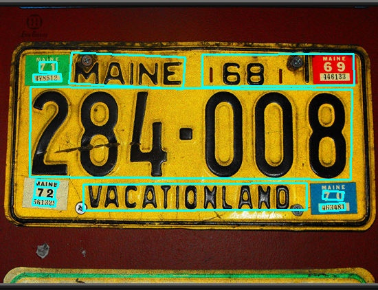

## Inference code for Lightweight Text Detection 

The inference code for paddle text detections model using onnxruntime.

### Usage

```bash
usage: inference.py [-h] [-w DET_MODEL_DIR] [-i IMAGE_PATH] [--onnx_check] [--det_db_thresh DET_DB_THRESH]
                    [--det_db_box_thresh DET_DB_BOX_THRESH] [--det_db_unclip_ratio DET_DB_UNCLIP_RATIO] [--max_batch_size MAX_BATCH_SIZE]
                    [--use_dilation USE_DILATION]

optional arguments:
  -h, --help            show this help message and exit
  -w DET_MODEL_DIR, --det_model_dir DET_MODEL_DIR
                        Path to onnx model weigts
  -i IMAGE_PATH, --image_path IMAGE_PATH
                        Path to test image
  --onnx_check          Pass if want to check onnx model with onnx.checker
  --det_db_thresh DET_DB_THRESH
  --det_db_box_thresh DET_DB_BOX_THRESH
  --det_db_unclip_ratio DET_DB_UNCLIP_RATIO
  --max_batch_size MAX_BATCH_SIZE
  --use_dilation USE_DILATION
```

### Visualization 

<div align="center">
    
    
</div>