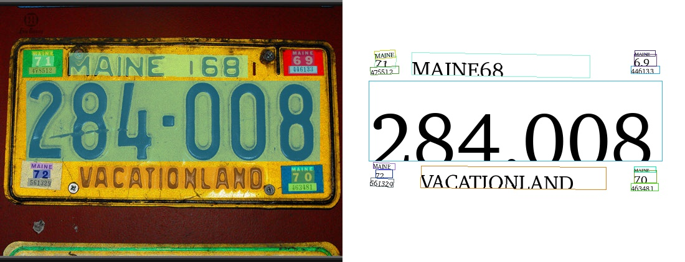

## Inference code for Lightweight Text Detection 

The inference code for paddle text detection, angle classification & recognition models using onnxruntime.

Used PaddlePaddle models: ch_ppocr_mobile_v2.0_xx

### Usage
We support either text detection pipeline (use `--run_detection` argument) or full pipeline with recognition (`--run_pipeline`). Note that these arguments conflict with each other.
```bash
usage: inference.py [-h] [--det_model_dir DET_MODEL_DIR]
                    [--cls_model_dir CLS_MODEL_DIR]
                    [--rec_model_dir REC_MODEL_DIR] [-i IMAGE_PATH]
                    [--onnx_check] [--run_detection | --run_pipeline]
                    [--det_db_thresh DET_DB_THRESH]
                    [--det_db_box_thresh DET_DB_BOX_THRESH]
                    [--det_db_unclip_ratio DET_DB_UNCLIP_RATIO]
                    [--max_batch_size MAX_BATCH_SIZE]
                    [--use_dilation USE_DILATION]
                    [--use_angle_cls USE_ANGLE_CLS] [--label_list LABEL_LIST]
                    [--cls_batch_num CLS_BATCH_NUM] [--cls_thresh CLS_THRESH]
                    [--rec_batch_num REC_BATCH_NUM]
                    [--rec_char_dict_path REC_CHAR_DICT_PATH]
                    [--use_space_char USE_SPACE_CHAR]
                    [--vis_font_path VIS_FONT_PATH] [--drop_score DROP_SCORE]

optional arguments:
  -h, --help            show this help message and exit
  --det_model_dir DET_MODEL_DIR
                        Path to onnx detection model weights
  --cls_model_dir CLS_MODEL_DIR
                        Path to onnx angle classifier model weights
  --rec_model_dir REC_MODEL_DIR
                        Path to onnx text recognition model weights
  -i IMAGE_PATH, --image_path IMAGE_PATH
                        Path to test image
  --onnx_check          Pass if want to check onnx model with onnx.checker
  --run_detection       Run detection model
  --run_pipeline        Run full recognition pipeline
  --det_db_thresh DET_DB_THRESH
  --det_db_box_thresh DET_DB_BOX_THRESH
  --det_db_unclip_ratio DET_DB_UNCLIP_RATIO
  --max_batch_size MAX_BATCH_SIZE
  --use_dilation USE_DILATION
  --use_angle_cls USE_ANGLE_CLS
  --label_list LABEL_LIST
  --cls_batch_num CLS_BATCH_NUM
  --cls_thresh CLS_THRESH
  --rec_batch_num REC_BATCH_NUM
  --rec_char_dict_path REC_CHAR_DICT_PATH
  --use_space_char USE_SPACE_CHAR
  --vis_font_path VIS_FONT_PATH
  --drop_score DROP_SCORE
```

### Visualization 

<div align="center">
    <h4> Full Pipeline </h4>
    
    <h4> Detection Only </h4>
    
</div>